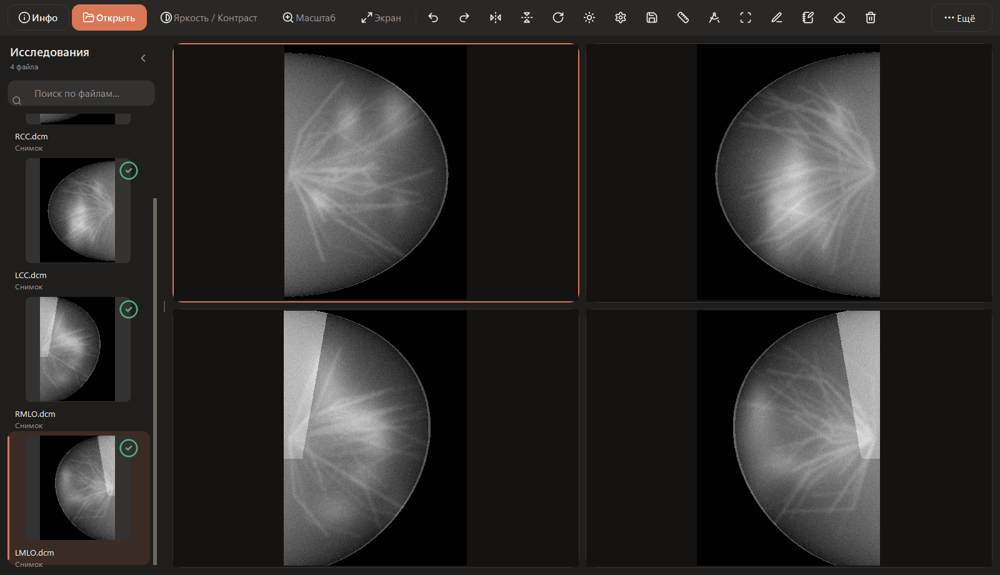
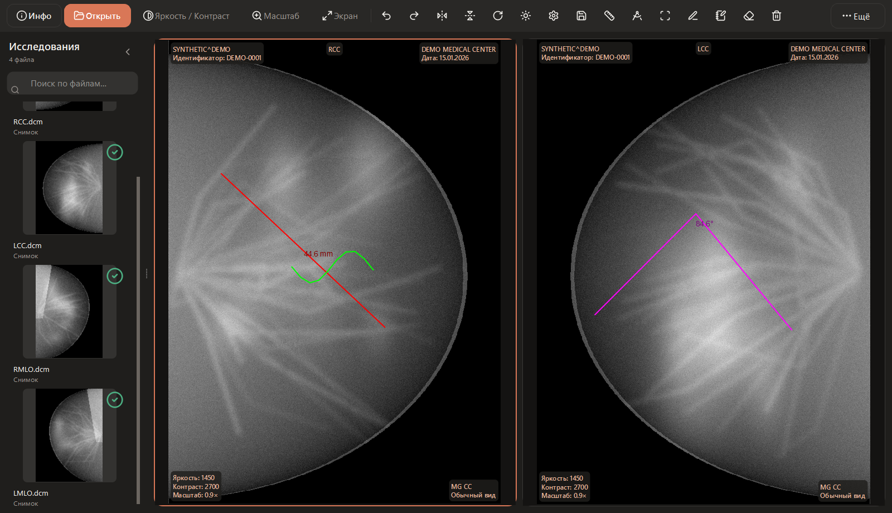
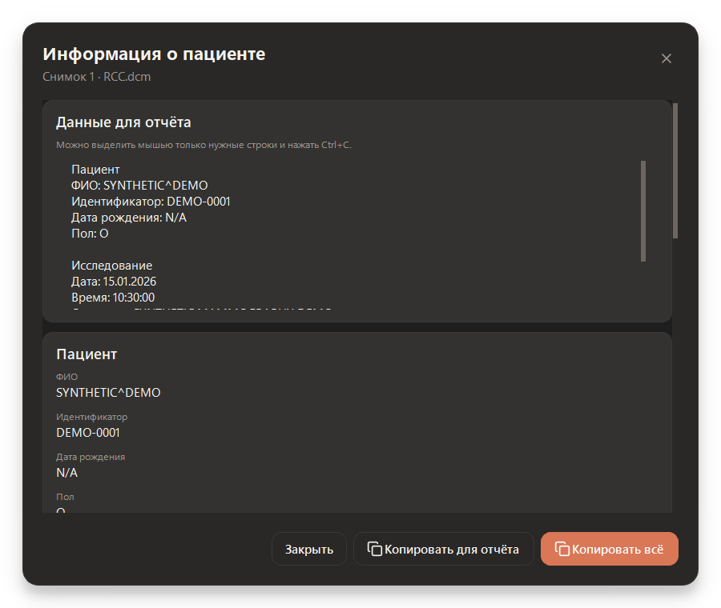
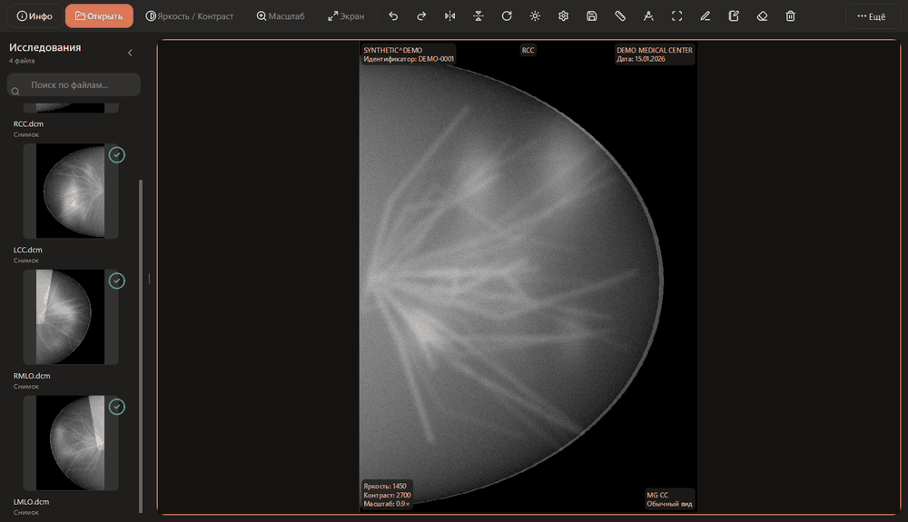

# Просмотр снимков

> Быстрый, спокойный и минималистичный DICOM‑просмотровик для врачей‑рентгенологов — без визуального шума и лишних действий.




## История проекта

Этот просмотрщик появился не как абстрактный pet‑project. Он создавался для мамы разработчика — врача, которой нужен был понятный рабочий инструмент: открыть папку с исследованием, быстро сравнить снимки, изменить яркость и контраст и скопировать данные пациента в отчёт.

Большинство медицинских просмотрщиков перегружены мелкими кнопками и техническими терминами. Здесь приоритет другой: крупные зоны нажатия, русский интерфейс, спокойная визуальная иерархия и быстрый доступ к самым частым действиям. Вдохновением для дизайн‑системы стали Claude, Linear и Notion, а область медицинского изображения намеренно оставлена тёмной для комфортного просмотра.

## Возможности

- открытие папки исследования, отдельного файла и drag‑and‑drop из Проводника;
- раскладки на 1, 2 или 4 снимка с автоматическим заполнением свободных окон;
- виртуализированный сайдбар с миниатюрами и поиском;
- плавное изменение яркости и контраста правой кнопкой мыши;
- масштабирование, перемещение, поворот и отражение снимка;
- линейка, измерение углов, области интереса, перо и заметки;
- базовая навигация по многокадровым DICOM;
- полноэкранный просмотр по двойному клику с постоянным доступом к «Инфо»;
- копирование отдельных полей или готового блока данных пациента для отчёта;
- светлая и тёмная темы, сохранение настроек между запусками;
- асинхронная загрузка, понятные ошибки и журнал с ротацией;
- декодирование несжатых DICOM, JPEG, JPEG‑LS и JPEG 2000.

| Измерения и пометки | Информация для отчёта |
|---|---|
|  |  |

### Инструменты в движении



## Управление

| Действие | Управление |
|---|---|
| Яркость / контраст | Зажать ПКМ и двигать мышь: по горизонтали — контраст, по вертикали — яркость |
| Масштаб | Колёсико мыши |
| Перемещение | Средняя кнопка мыши или `Shift` + ЛКМ |
| Один снимок крупно | Двойной клик по снимку |
| Выход из крупного режима | `Esc` или повторный двойной клик |
| Следующий/предыдущий кадр | `Alt` + колёсико |
| Системный полноэкранный режим | `F11` |

## Быстрый запуск из исходников

Требуется **Windows 10/11** и **Python 3.12**.

```powershell
git clone <адрес-вашего-репозитория>
cd claude_dicom_viewer

py -3.12 -m venv .venv
.venv\Scripts\Activate.ps1
python -m pip install --upgrade pip
pip install -r requirements.txt
python main.py
```

Готовую Windows‑сборку рекомендуется публиковать во вкладке **Releases**, а не хранить `.exe` в истории Git. После публикации её можно будет скачать без установки Python.

## Технологии

- **Python 3.12** — бизнес‑логика, обработка ошибок и фоновые задачи;
- **PyQt6 / Qt Widgets** — нативный интерфейс и точный рендер снимков;
- **PyQt6‑Fluent‑Widgets** — меню, переключатели и современные состояния компонентов;
- **pydicom** — чтение метаданных и пиксельных данных DICOM;
- **NumPy** — быстрая обработка яркости, контраста и оконных преобразований;
- **pylibjpeg / pyjpegls / openjpeg** — декодирование сжатых DICOM;
- **Lucide Icons** — единый набор линейных иконок;
- **Inter Variable** — встроенный интерфейсный шрифт.

Рендер медицинских изображений остаётся нативным Qt‑рендером. Веб‑движок, Canvas и дополнительное сжатие изображений не используются.

## Тесты

```powershell
$env:QT_QPA_PLATFORM='offscreen'
python -m unittest discover -s tests -v
```

В текущей версии проходят **64 автоматических теста**: безопасная загрузка, кодировки, многокадровые файлы, управление мышью, responsive‑интерфейс, перестановка снимков, сохранение настроек и закрытие во время фоновой загрузки.

## Приватность медицинских данных

В репозитории **нет реальных DICOM‑файлов**. Все изображения на этой странице построены алгоритмически и не относятся ни к одному человеку.

Перед публикацией любых медицинских данных недостаточно удалить только ФИО из заголовка: идентификаторы могут находиться в приватных тегах, имени файла и непосредственно в пикселях снимка. Прочитайте [правила безопасной публикации](docs/PRIVACY.md) и запустите:

```powershell
python scripts/check_release_privacy.py
```

> **Важно:** приложение не является зарегистрированным медицинским изделием. Решения, влияющие на диагностику и лечение, должны приниматься только в рамках утверждённых клинических процессов и с использованием сертифицированного оборудования.

## Структура проекта

```text
core/       загрузка, декодирование, обработка изображений и ошибки
models/     данные открытых областей просмотра
resources/  дизайн‑токены, шрифт и Lucide‑иконки
tools/      измерения, перо, заметки и Undo/Redo
ui/         главное окно, viewport, сайдбар и диалоги
tests/      автоматические регрессионные тесты
docs/       приватность и чек‑лист публикации
scripts/    проверка релиза и генерация синтетических медиа
```

## Благодарности

Проект использует [Inter](https://rsms.me/inter/) и [Lucide Icons](https://lucide.dev/); тексты их лицензий находятся рядом с ресурсами. Спасибо экосистемам Qt, pydicom и NumPy за фундамент, на котором можно строить быстрые медицинские инструменты.

